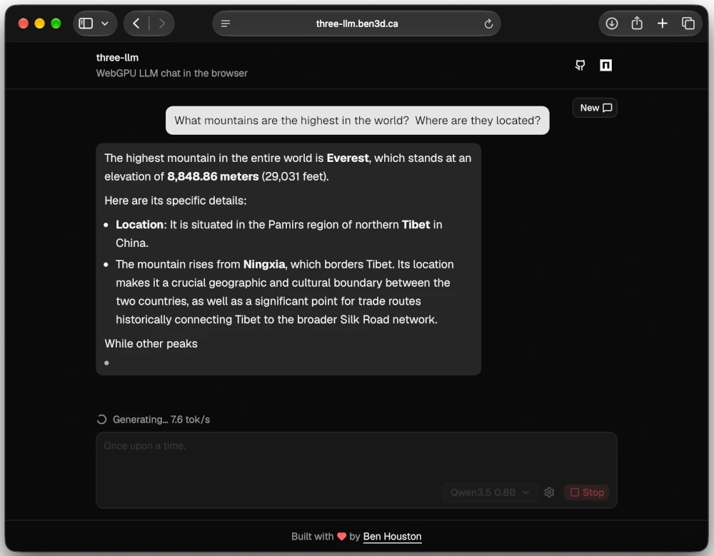

# three-llm

[](https://www.npmjs.com/package/three-llm)
[](https://three-llm.ben3d.ca)

Run large language models in the browser with WebGPU. `three-llm` implements transformer inference with [Three.js](https://threejs.org/) and its TSL compute shader system, so model execution stays on the user's GPU without a server-side inference runtime.

**[Try the live demo: threekit-llm.ben3d.ca](https://three-llm.ben3d.ca)** · **[Read the technical write-up](https://ben3d.ca/blog/running-llms-in-the-browser-with-threejs)**



## Features

- WebGPU inference through Three.js TSL compute shaders
- CPU reference runners for testing and validation
- Prompt caching, chunked prefill, streaming token callbacks, and GPU sampling
- GPT-2, Llama-style, Gemma 3, Phi, and Qwen 3.5 decoder architectures
- GPT-2 BPE, Qwen BPE, and unigram tokenizers
- Chat prompt formatting via `formatPrompt`
- Direct loading of Hugging Face SafeTensors checkpoints

## Requirements

- A browser with WebGPU support, such as a recent Chrome, Edge, or Safari release
- Enough device memory for the selected model and its intermediate buffers

Model files can range from a few megabytes to several gigabytes. Remote Hugging Face repositories must allow browser CORS requests.

## Install

```sh
pnpm add three-llm three
```

## Usage

Create a Three.js WebGPU renderer, load a compatible Hugging Face checkpoint, and generate text:

```ts
import { createTSLRunner } from 'three-llm';
import { WebGPURenderer } from 'three/webgpu';

const renderer = new WebGPURenderer();
await renderer.init();

const runner = await createTSLRunner('https://huggingface.co/HuggingFaceTB/SmolLM2-135M/resolve/main/', {
  onProgress: console.log,
  prefillChunkSize: 4,
});

const result = await runner.generate(renderer, 'Once upon a time,', {
  maxNewTokens: 64,
  temperature: 0.7,
  topK: 10,
  onToken: (text) => {
    // Append each decoded token to your UI.
    console.log(text);
  },
});

console.log(result.generatedText);
```

For multi-turn chat, pass formatted messages with `formatPrompt` from `three-llm`. For catalog entries and URL resolution, import `MODEL_CATALOG` and `resolveModelURL` from `three-llm/catalog`.

## Run the demo locally

To work on the chat app or test against the hosted model bucket:

```sh
corepack enable
pnpm install
pnpm dev
```

Open [http://localhost:3000](http://localhost:3000). The demo loads checkpoints through the website's `/api/models/` proxy backed by the public [`gs://three-llm`](https://storage.googleapis.com/three-llm/) bucket, and falls back to Hugging Face if a file is missing.

## Development

This monorepo uses pnpm workspaces:

- `packages/three-llm`: the inference library, model loaders, tokenizers, and TSL kernels
- `packages/website`: the React chat demo

Requirements: Node.js 20 or newer, pnpm 11.

```sh
pnpm dev            # watch the library and run the demo
pnpm build          # build every workspace package
pnpm test           # run type checks and unit tests
pnpm test:e2e       # run Playwright tests
pnpm lint           # check source with Oxlint
pnpm format         # format the repository with Oxfmt
```

## License

[MIT](LICENSE) © 2026 Ben Houston
